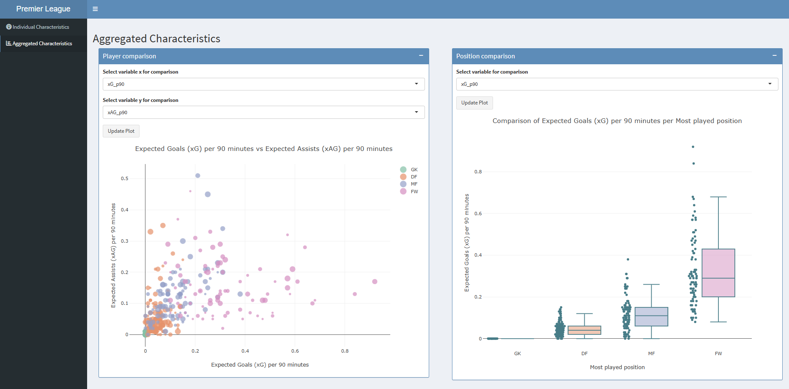

# Premier League 2022-2023 Player Stats Dashboard

This is a Shiny dashboard designed to analyze and visualize player performance statistics from the 2022-2023 Premier League season. It allows for the exploration of individual player metrics and aggregated comparisons across different positions.



## Features

The dashboard is divided into two main sections:

### 1. Individual Characteristics
* **Player Selection**: Choose any player from the 2022-2023 season (who played a minimum of 900 minutes).
* **Performance Percentile Plot**: A polar (radar) chart visualizes the player's percentile ranks against all other players in seven key metrics:
    * Goals per 90
    * Assists per 90
    * Expected Goals (xG) per 90
    * Expected Assists (xAG) per 90
    * Progressive Carries per 90
    * Progressive Passes per 90
    * Progressive Passes Received per 90
* **Key Stat Boxes**: At-a-glance view of the selected player's core stats, including total goals, assists, minutes played, team, nationality, and year of birth.

### 2. Aggregated Characteristics
* **Player Comparison (Scatter Plot)**: An interactive `plotly` scatter plot that lets you compare any two statistics from the dataset (e.g., `xG_p90` vs. `xAG_p90`).
    * Points are color-coded by position (GK, DF, MF, FW).
    * Point size is relative to the player's total minutes played.
    * Hover over any point to see the player's name.
* **Position Comparison (Box Plot)**: An interactive `plotly` box plot to visualize the distribution of any selected statistic across the four main player positions, helping to identify positional trends.

## Technology Stack

* **Language**: R
* **Core Framework**: Shiny (`shiny`, `shinydashboard`, `shinythemes`)
* **Data Visualization**: `ggplot2` (for the polar plot) and `plotly` (for interactive plots)
* **Data Manipulation**: `dplyr`, `stringr`
* **Data Loading**: `readxl`

## Data Source

The data used in this project (`Players.xlsx`) was sourced from **fbref.com** for the 2022-2023 Premier League season.

The raw data was processed within the R script to:
* Clean and rename columns.
* Calculate per 90-minute statistics for progressive actions.
* Filter for players with >= 900 minutes played.
* Calculate percentile ranks for the key visualization metrics.

## How to Run This Project Locally

1.  **Prerequisites**:
    * [R](https://cran.r-project.org/)
    * An R-compatible IDE like [RStudio](https://posit.co/download/rstudio-desktop/) or [VS Code](https://code.visualstudio.com/) with the R extension.

2.  **Clone the Repository**:
    ```bash
    git clone https://github.com/pedrito868/Premier_League_Dashboard.git    
    cd <your-repository-name>
    ```

3.  **Install Required R Packages**:
    Open your R console and run the following command to install all necessary libraries:
    ```r
    install.packages(c("shiny", "ggplot2", "plotly", "formatR", "stringr", "shinythemes", "dplyr", "shinydashboard", "readr", "readxl", "Hmisc"))
    ```

4.  **Run the App**:
    Open the `dashboard_code.R` file in your IDE and run it as a Shiny Application.
    * In RStudio, you can click the "Run App" button.
    * From any R console, you can run:
        ```r
        shiny::runApp("dashboard_code.R")
        ```  ```

## License

This project is licensed under the MIT License. See the `LICENSE` file for details.